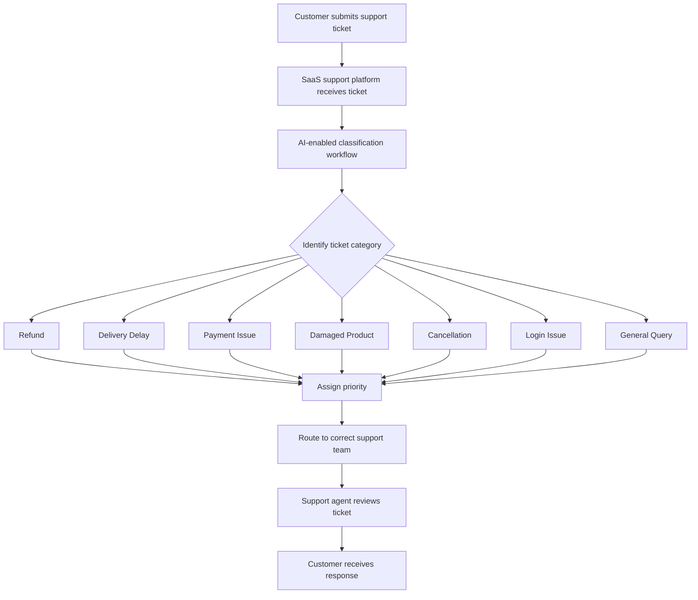

# Ticket-Triage-Delivery
SaaS-style AI delivery simulation for customer support ticket triage, including BRD, PRD, user stories, implementation plan, demo script, training guide, and sample ticket data.

# AI-Powered Customer Support Ticket Triage – SaaS Delivery Simulation

## Project Overview

This project is a SaaS implementation and AI delivery simulation for a customer support platform. The objective is to help a mock e-commerce client classify incoming customer support tickets by issue type, assign priority, and route each ticket to the correct support team.

This project demonstrates requirement understanding, BRD/PRD documentation, user stories, implementation planning, demo preparation, and training documentation for an AI-enabled customer experience workflow.


# Workflow Diagram




## Mock Client

**Client Name:** UrbanCart  
**Industry:** E-commerce / Online Retail  
**Business Context:** UrbanCart receives customer support tickets related to refunds, delivery delays, payment failures, cancellations, damaged products, and login issues.

## Business Problem

UrbanCart's support team manually reads and sorts customer tickets. This causes slow response time, inconsistent prioritization, missed escalations, and poor customer experience.

## Proposed SaaS Solution

The proposed AI-enabled SaaS workflow will:

- Classify incoming support tickets into predefined categories.
- Assign a priority level based on urgency and customer sentiment.
- Route tickets to the correct internal support team.
- Flag high-priority cases for faster action.
- Provide support agents with structured ticket details.

## Ticket Categories

- Refund
- Delivery Delay
- Payment Issue
- Damaged Product
- Cancellation
- Login Issue
- General Query

## Priority Rules

- **High:** Payment failure, repeated complaint, angry customer, escalation request, damaged product with urgent tone.
- **Medium:** Refund pending, delivery delayed, cancellation request.
- **Low:** General query, order status request, basic account help.

## Repository Structure

```text
ai-cx-ticket-triage-delivery/
├── README.md
├── docs/
│   ├── BRD.md
│   ├── PRD.md
│   ├── User-Stories.md
│   ├── Implementation-Plan.md
│   ├── Demo-Script.md
│   └── Training-Guide.md
├── sample-data/
│   └── customer_tickets.csv
└── screenshots/
    └── workflow-diagram.md
```

## Skills Demonstrated

- SaaS implementation understanding
- AI-enabled workflow planning
- Business requirement documentation
- Product requirement documentation
- User story creation
- Acceptance criteria writing
- Project coordination
- Demo preparation
- Training documentation
- Technical and business communication

## Disclaimer

This is an independent academic/portfolio simulation project. It does not represent a live client implementation.

