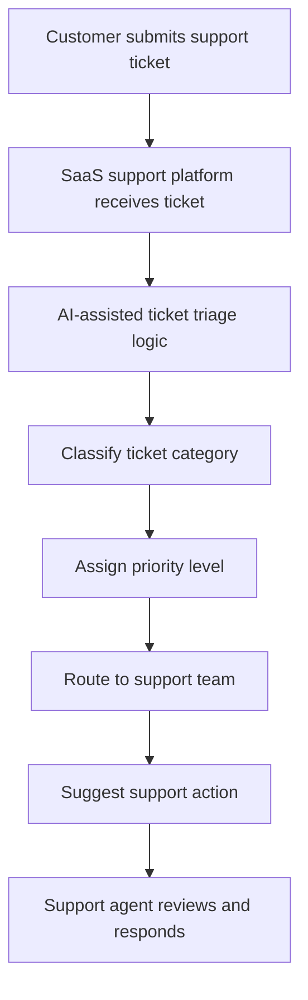
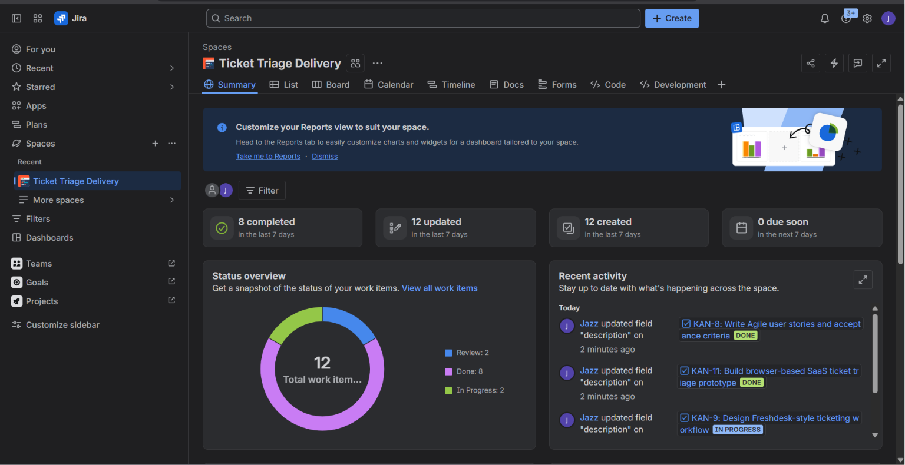
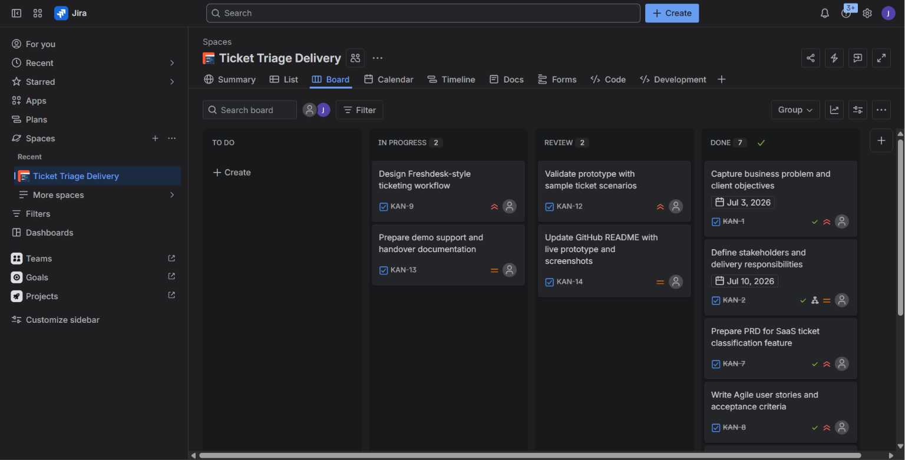
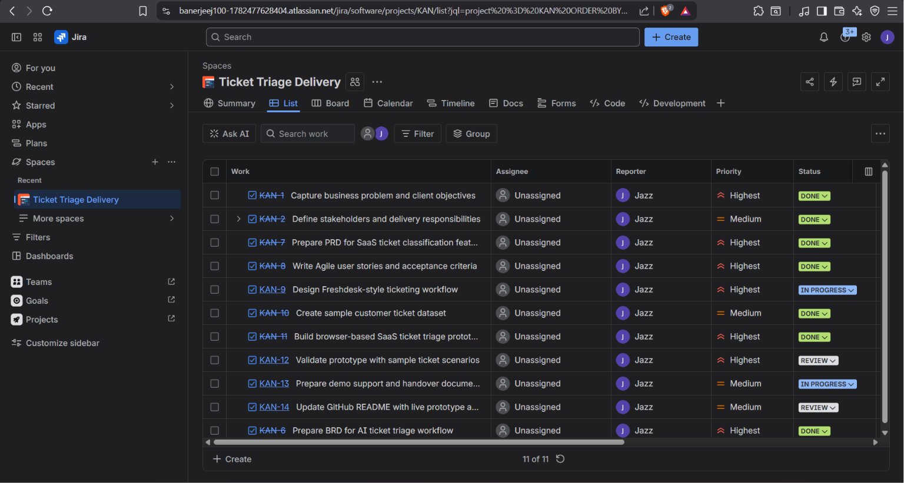
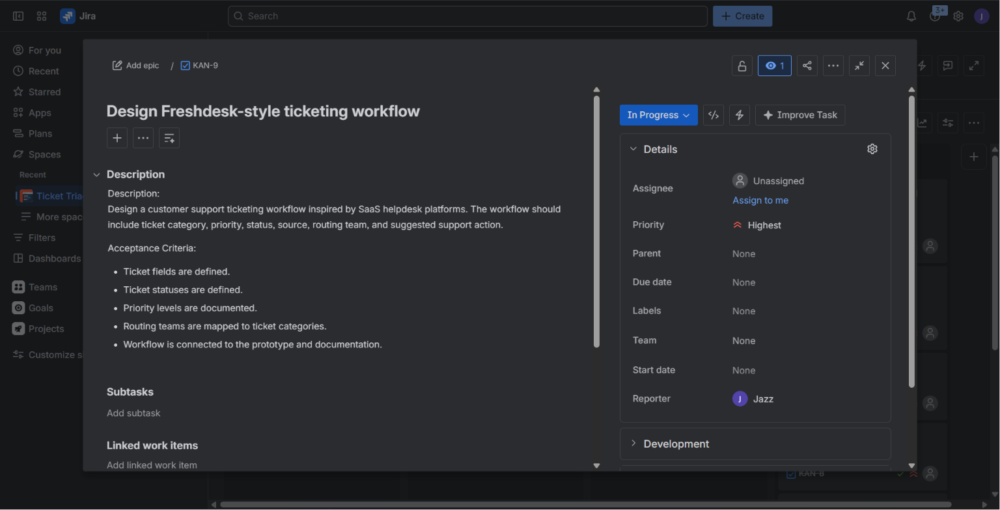
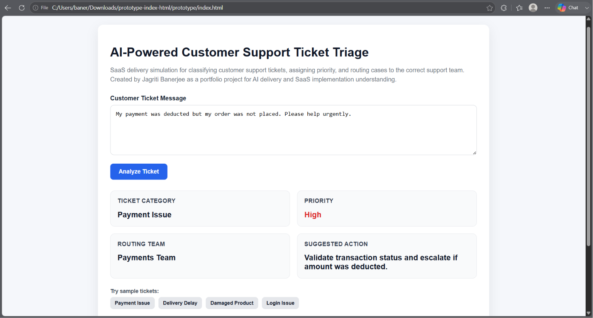
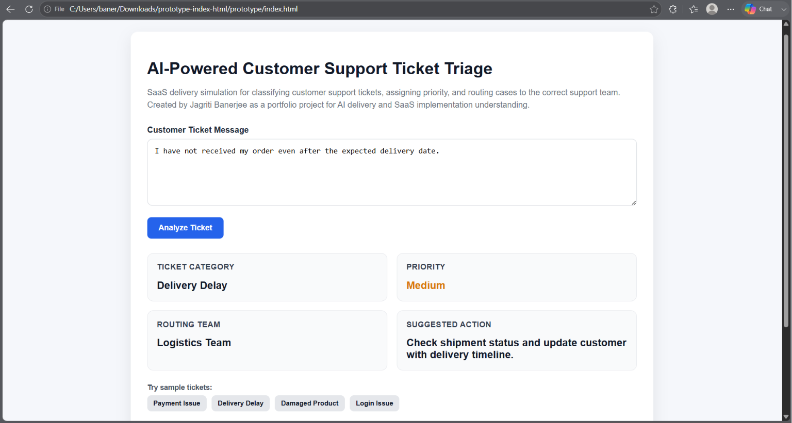
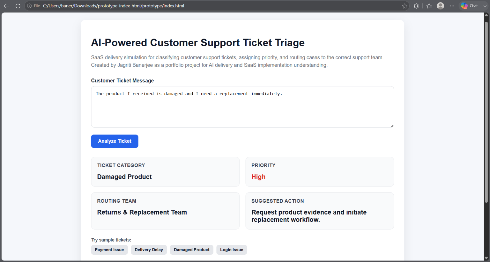
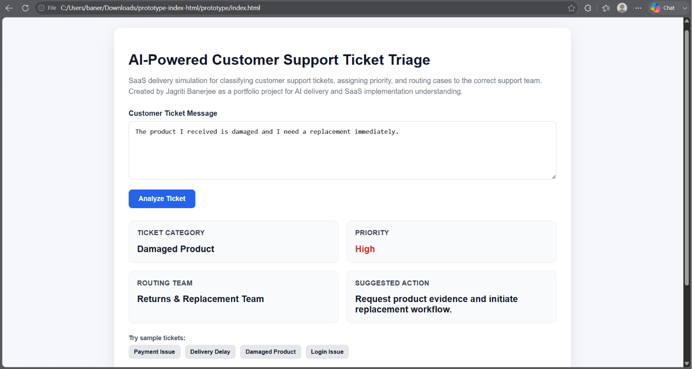
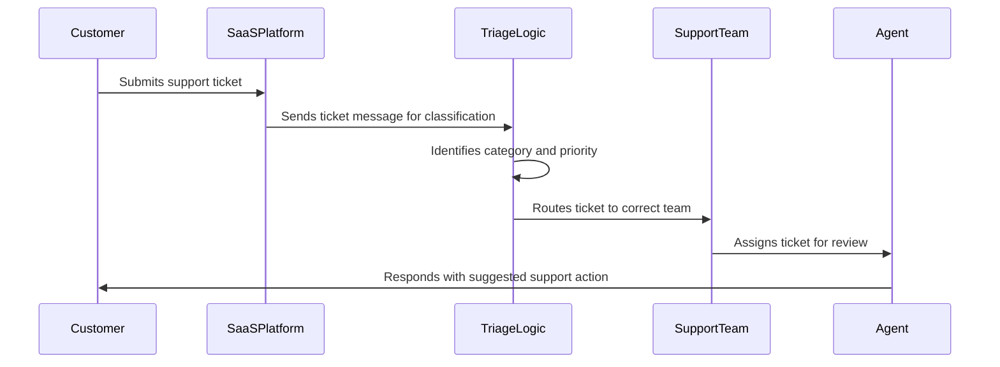

<div align="center">

# AI-Powered Customer Support Ticket Triage

### SaaS Delivery Simulation | AI Workflow Prototype | Jira Agile Tracking | BRD / PRD / User Stories


<br>


<br>

**Created by: Jagriti Banerjee**

[Live Prototype](https://jazz00001.github.io/Ticket-Triage-Delivery/prototype/) | [GitHub Repository](https://github.com/Jazz00001/Ticket-Triage-Delivery) · 
[Jira Agile Board](https://banerjeej100-1782477628404.atlassian.net/jira/software/projects/KAN/summary)

</div>

---

## Project Links

| Resource          | Link                                                                                                   |
| ----------------- | ------------------------------------------------------------------------------------------------------ |
| Live Prototype    | [Open Prototype](https://jazz00001.github.io/Ticket-Triage-Delivery/prototype/)                        |
| GitHub Repository | [View Repository](https://github.com/Jazz00001/Ticket-Triage-Delivery)                                 |
| Jira Agile Board  | [View Jira Board](https://banerjeej100-1782477628404.atlassian.net/jira/software/projects/KAN/summary) |


---

## Executive Summary

This project is a portfolio-based **SaaS delivery simulation** for an **AI-assisted customer support ticket triage workflow**.

The objective is to demonstrate how business requirements can be translated into structured product documentation, Agile user stories, implementation planning, Jira-based delivery tracking, demo support material, and a working browser-based prototype.

The project simulates a customer support SaaS workflow where incoming customer messages are classified by issue type, assigned a priority level, routed to the appropriate support team, and given a suggested support action.

This project was created to demonstrate readiness for entry-level roles involving:

* AI delivery support
* SaaS implementation support
* Business requirement documentation
* Product requirement documentation
* Agile project tracking
* Client demo preparation
* Cross-functional delivery coordination

---

## Business Context

A mock e-commerce company, **UrbanCart**, receives customer support tickets related to:

* Payment failures
* Refund requests
* Delivery delays
* Damaged products
* Order cancellations
* Login issues
* General customer queries

In a manual support process, agents must read every ticket, identify the issue, decide urgency, assign priority, and route it to the correct support team. This can lead to delayed response times, inconsistent ticket categorization, missed escalations, and a weaker customer experience.

---

## Proposed Solution

The proposed solution is an **AI-assisted SaaS ticket triage workflow** that supports customer experience operations by:

* Classifying incoming support tickets into predefined categories
* Assigning priority based on issue type and urgency
* Routing tickets to the correct support team
* Suggesting the next support action
* Supporting demo and training readiness through structured documentation
* Tracking delivery tasks through a Jira Agile board

> The working prototype uses rule-based logic to simulate AI-assisted triage. It is not a production AI model, live SaaS deployment, or real client implementation.

---

## Live Prototype

The browser-based prototype allows a user to enter a customer support message and receive:

* Ticket Category
* Priority Level
* Routing Team
* Suggested Support Action

### Open Prototype

[Launch Live Prototype](https://jazz00001.github.io/Ticket-Triage-Delivery/prototype/)

---

## Solution Workflow



---

## Ticket Categories and Routing Logic

| Ticket Category | Example Customer Issue                 | Routing Team               |
| --------------- | -------------------------------------- | -------------------------- |
| Payment Issue   | Payment deducted but order not placed  | Payments Team              |
| Refund          | Refund status request                  | Billing & Refund Team      |
| Delivery Delay  | Order not delivered on time            | Logistics Team             |
| Damaged Product | Product received broken or defective   | Returns & Replacement Team |
| Cancellation    | Customer wants to cancel order         | Order Management Team      |
| Login Issue     | Unable to login after password reset   | Technical Support Team     |
| General Query   | Delivery address update or basic query | General Support Team       |

---

## Priority Model

| Priority | Use Case                                                                  |
| -------- | ------------------------------------------------------------------------- |
| High     | Payment failure, damaged product, repeated complaint, escalation language |
| Medium   | Refund pending, delayed delivery, cancellation request                    |
| Low      | General query, login guidance, basic account support                      |

---

## Customer Support SaaS Ticketing Workflow

This project simulates a customer support SaaS ticketing workflow where each support ticket is structured using:

* Ticket ID
* Customer Message
* Issue Category
* Priority Level
* Routing Team
* Suggested Support Action

The workflow connects business requirement documentation, product requirement documentation, Agile user stories, sample ticket data, Jira delivery tracking, demo support material, and the working GitHub Pages prototype.

---

## Project Delivery Approach

This project uses a hybrid delivery approach combining **Agile execution practices** with **Waterfall-style documentation**.

### Agile Elements

* Jira-based delivery tracking
* User stories
* Acceptance criteria
* Backlog-style task planning
* Prototype validation
* Review stages
* Demo readiness

### Waterfall Elements

* Business Requirement Document
* Product Requirement Document
* Implementation Plan
* Demo Script
* Training Guide
* Handover-ready documentation

---

## Jira Agile Delivery Tracking

A Jira board was created to simulate Agile project tracking for this SaaS delivery project.

The board tracks work across:

* Requirement discovery
* BRD / PRD documentation
* Agile user stories
* SaaS ticketing workflow design
* Prototype validation
* Demo support
* Handover documentation

The board includes task priorities, workflow statuses, review stages, and acceptance criteria to demonstrate SaaS implementation tracking from planning to delivery.

### Jira Project Overview



### Jira Board Overview



### Jira List View



### SaaS Ticketing Workflow Task



---

## Working Prototype Screenshots

The prototype demonstrates AI-assisted ticket triage by classifying customer messages, assigning priority, selecting a routing team, and suggesting the next support action.

### Payment Issue Classification



### Delivery Delay Classification



### Damaged Product Classification



### Login Issue Classification



---

## Documentation Included

| Document            | Purpose                                                                                                                                  |
| ------------------- | ---------------------------------------------------------------------------------------------------------------------------------------- |
| BRD                 | Captures business problem, objectives, stakeholders, scope, assumptions, risks, and success metrics                                      |
| PRD                 | Defines product objective, user roles, features, functional requirements, non-functional requirements, routing logic, and priority rules |
| User Stories        | Converts requirements into Agile user stories with acceptance criteria                                                                   |
| Implementation Plan | Defines delivery phases, workstreams, dependencies, quality gates, and handover approach                                                 |
| Demo Script         | Supports client-facing walkthrough and solution explanation                                                                              |
| Training Guide      | Explains how support users can understand and use the workflow                                                                           |
| Sample Dataset      | Provides sample customer tickets for validation and demonstration                                                                        |

---

## Repository Structure

```text
Ticket-Triage-Delivery/
│
├── README.md
│
├── docs/
│   ├── BRD.md
│   ├── PRD.md
│   ├── User-Stories.md
│   ├── Implementation-Plan.md
│   ├── Demo-Script.md
│   
│
├── prototype/
│   └── index.html
│
├── sample-data/
│   └── customer_tickets.csv
│
└── screenshots/
    ├── jira-board-overview.png
    ├── jira-freshdesk-workflow-task.png
    ├── jira-list-view.png
    ├── jira-overview.png
    ├── ticket-analysis-damaged-product.png
    ├── ticket-analysis-delivery-delay.png
    ├── ticket-analysis-login-issue.png
    └── ticket-analysis-payment-issue.png
```

---

## Tools and Concepts Used

| Area                  | Tools / Concepts                                                                                    |
| --------------------- | --------------------------------------------------------------------------------------------------- |
| Project Tracking      | Jira                                                                                                |
| Prototype Development | HTML, CSS, JavaScript                                                                               |
| Hosting               | GitHub Pages                                                                                        |
| Documentation         | Markdown, BRD, PRD, User Stories                                                                    |
| Delivery Methodology  | Agile, Waterfall                                                                                    |
| Data                  | CSV sample ticket dataset                                                                           |
| SaaS Workflow         | Customer support ticketing workflow                                                                 |
| AI Delivery Support   | AI-assisted classification planning, triage logic, demo support, requirement-to-prototype alignment |

---

## Key Skills Demonstrated

* SaaS implementation understanding
* AI-assisted workflow planning
* Business requirement documentation
* Product requirement documentation
* Agile user story writing
* Acceptance criteria creation
* Jira-based Agile tracking
* Waterfall-style documentation
* Customer support ticketing workflow design
* Demo support preparation
* Training documentation
* Prototype validation
* Technical and business communication
* Cross-functional delivery thinking

---

## Sample Ticket Flow



---

## Example Classification Output

| Customer Message                                               | Category        | Priority | Routing Team               | Suggested Action                                         |
| -------------------------------------------------------------- | --------------- | -------- | -------------------------- | -------------------------------------------------------- |
| My payment was deducted but my order was not placed.           | Payment Issue   | High     | Payments Team              | Validate transaction and escalate if amount was deducted |
| I have not received my order after the expected delivery date. | Delivery Delay  | Medium   | Logistics Team             | Check shipment status and update customer                |
| The product I received is damaged.                             | Damaged Product | High     | Returns & Replacement Team | Request evidence and initiate replacement                |
| I cannot login after resetting my password.                    | Login Issue     | Low      | Technical Support Team     | Guide customer through account recovery                  |

---

## Requirement-to-Delivery Traceability

| Delivery Layer | Project Output                                           |
| -------------- | -------------------------------------------------------- |
| Business Need  | Faster and more consistent customer ticket handling      |
| BRD            | Business problem, objectives, scope, stakeholders, risks |
| PRD            | Functional requirements, priority logic, routing logic   |
| User Stories   | Agile stories and acceptance criteria                    |
| Jira Board     | Delivery tracking, priorities, review stages             |
| Prototype      | Working browser-based ticket triage demo                 |
| Demo Script    | Client-facing walkthrough support                        |
| Training Guide | Support user guidance                                    |
| README         | Public-facing project explanation and evidence           |

---

## Project Outcome

This project demonstrates how a candidate can support an AI delivery / SaaS implementation role by converting business needs into structured documentation, Agile tasks, product requirements, demo-ready workflows, and a working prototype.

It shows practical understanding of:

* Requirement gathering
* Business analysis
* Product documentation
* Agile tracking
* SaaS workflow design
* AI-assisted ticket triage
* Demo support
* Handover documentation

---

## Interview Positioning

This project can be explained as:

> I created this as a SaaS delivery simulation. I first documented the business problem through a BRD, then translated it into a PRD, Agile user stories, and an implementation plan. I also created a Jira board to track the delivery lifecycle. Finally, I built a browser-based GitHub Pages prototype where a user can enter a customer support ticket and receive category, priority, routing team, and suggested support action. The prototype uses rule-based logic to simulate AI-assisted ticket triage and connects documentation, delivery planning, and working demo execution.

---

## Disclaimer

This is an independent academic and portfolio simulation project created for learning and demonstration purposes.

It does not represent a live client implementation, production AI model, or commercial SaaS deployment.

</div>
